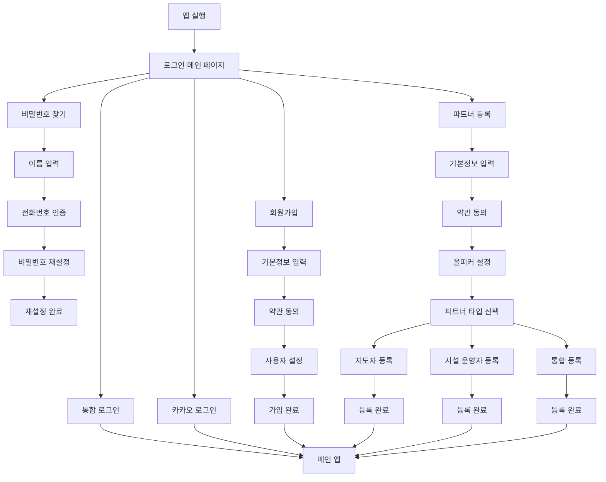
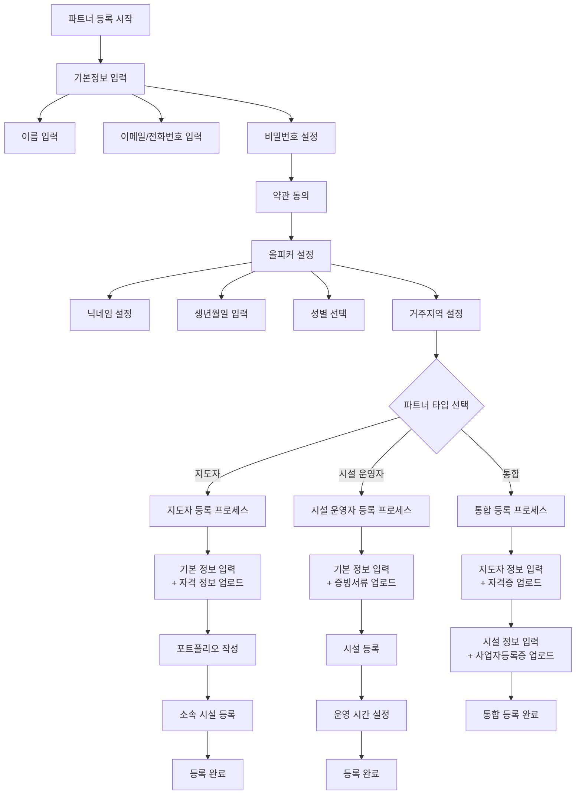
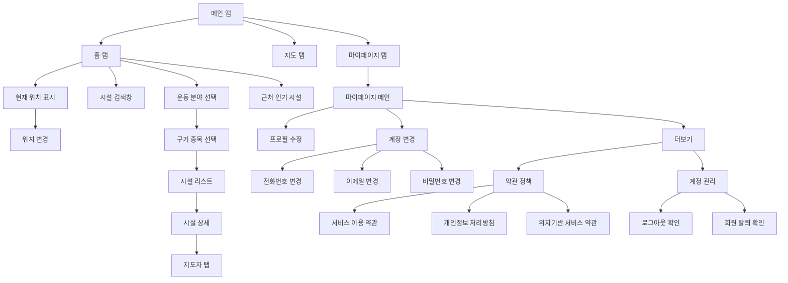
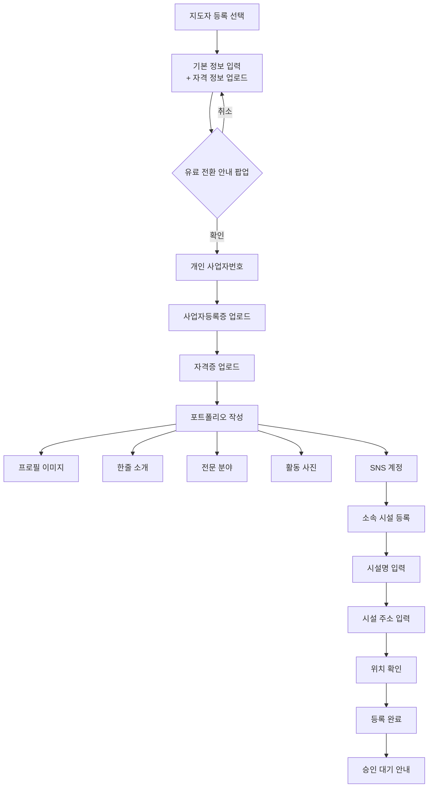
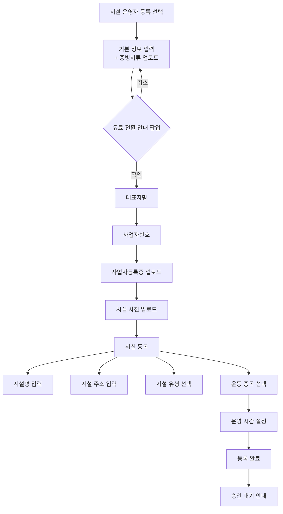
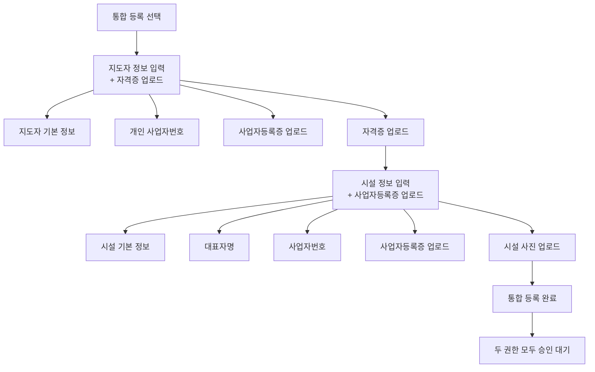

# 모두의 핏 앱 플로우차트 (Mermaid)

## 1. 전체 앱 구조 플로우

## 2. 파트너 등록 상세 플로우

## 3. 메인 앱 플로우

## 4. 지도자 등록 상세 플로우

## 5. 시설 운영자 등록 상세 플로우

## 6. 통합 등록 상세 플로우

## 사용 방법

1. 위의 Mermaid 코드를 복사
2. [Mermaid Live Editor](https://mermaid.live/)에 붙여넣기
3. 자동으로 플로우차트가 생성됨
4. PNG, SVG 등으로 다운로드 가능

## 주요 특징

- **파트너 등록**: 일반 사용자 가입부터 시작하여 올피커 설정까지 완료 후 역할 선택
- **3가지 선택지**: 지도자, 시설 운영자, 통합 등록
- **유료 전환 안내**: 지도자 등록 시 팝업으로 사전 안내
- **기존 정보 활용**: 이미 입력한 정보를 파트너 등록 시 재사용
- **승인 프로세스**: 모든 파트너 등록은 관리자 승인 후 활성화
